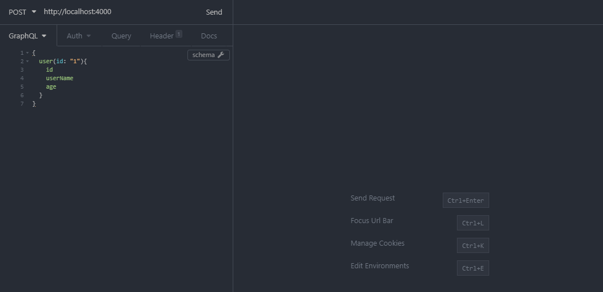

# my simple koa/graphql server 👨‍💻💨



A super simple nodejs/koa server with a single graphql endpoint.
Currently using json-server (see db.json) for storing dummy data.

### Installing

First

```
yarn
```

then to run

```
yarn start
```

## Authors

* **Michael Saunders** - *Initial work* - [arcaneflorist](https://github.com/arcaneflorist)

## License

This project is licensed under the MIT License - see the [LICENSE.md](LICENSE.md) file for details